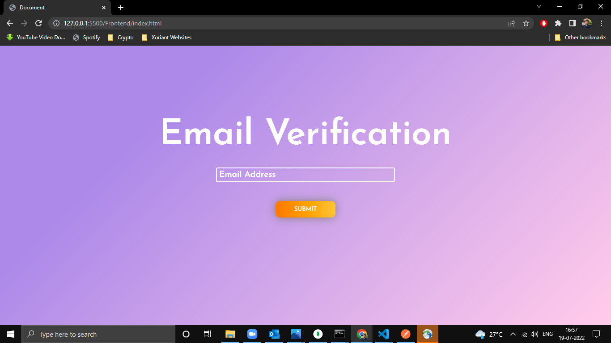
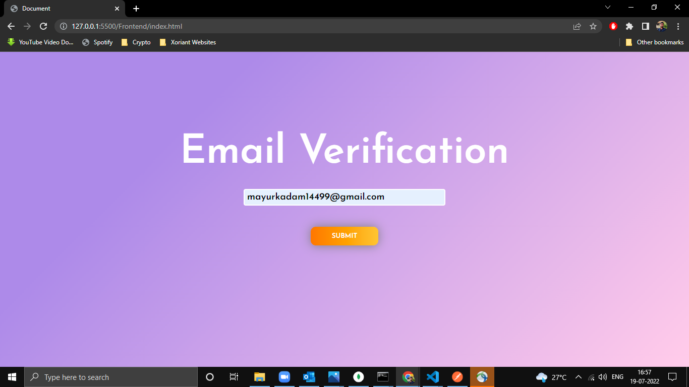
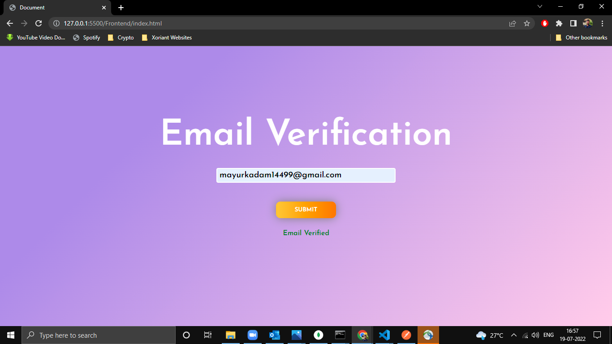
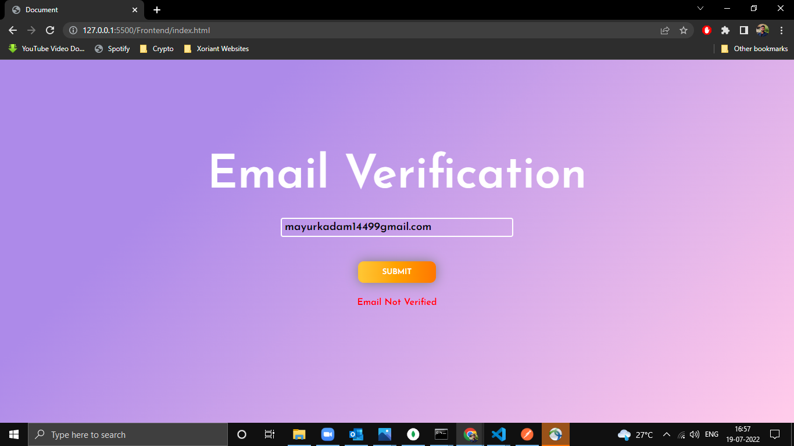

# Email Verifier Tool

## Description

This is a simple API built using gin gonic (Golang) . This application is used to validate the email address provided by the user.
* Go, also known as Golang, is an open-source, compiled, and statically typed programming language designed by Google. It is built to be simple, high-performing, readable, and efficient.

* Gin is a high-performance micro-framework that can be used to build web applications and microservices. It makes it simple to build a request handling pipeline from modular, reusable pieces. It does this by allowing you to write middleware that can be plugged into one or more request handlers or groups of request handlers.

----

## Pre-requisites
 Install Golang
 * [Installation for Windows](https://go.dev/doc/install) 
 * [Installation for Linux](https://golangdocs.com/install-go-linux)

 Install Gin-Gonic 
 
 * [Command to Install Gin-Gonic](https://gin-gonic.com/docs/)


 ---
 ## Getting Started

 1. Clone the repository using:
 ```
 git clone https://github.com/code-moro/Email-Verifier-Tool.git
 ```
 2. Install Gin Gonic Framework
 ```
 go get -u github.com/gin-gonic/gin
 ```
 3. Vist the Given link and hit Greet button
```
http://127.0.0.1:5500/Frontend/index.html
```
 4. Regular Expression used to validate Email Address
 ```
 '^[a-z0-9._%+\-]+@[a-z0-9.\-]+\.[a-z]{2,4}$'
 ```

---
## API Endpoints

## /
  
 When user enter the email address and click on submit button on Home page Api call is made to backend which returns whether the given email address is valid or not.
  

### 1.Index page



---

### 2.User Enters Email-Id



---
### 3.Email Address verified 


---
### 4. Email Address verification failed

 
 ----